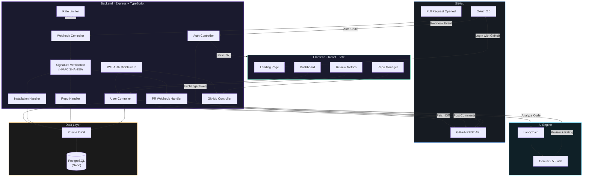

<div align="center">

# 🐗 ReviewHog

**AI-powered code reviews on every pull request — so you can ship faster with confidence.**

[](https://github.com/apps/reviewhog)
[](https://ai.google.dev/)
[](LICENSE)

</div>

---

## 🧐 The Problem

Code reviews are one of the most critical parts of the software development lifecycle — and also one of the slowest. In most teams:

- Pull requests sit in the queue for **hours or days** waiting for a reviewer.
- Reviewers are often **overloaded**, leading to rubber-stamp approvals that miss real bugs.
- Junior developers don't get **consistent, actionable feedback** on their code quality.
- Security vulnerabilities, unhandled edge cases, and code smells **slip through** to production.

Manual code review doesn't scale. As teams grow and PRs pile up, quality inevitably suffers.

---

## 💡 The Solution

**ReviewHog** is a GitHub App that plugs directly into your workflow and delivers instant, AI-powered code reviews on every pull request — automatically.

When a PR is opened, ReviewHog analyzes each changed file using **Google Gemini 2.5 Flash**, posts detailed per-file feedback as comments on the PR, and assigns a quality rating based on a strict, well-defined rubric. No setup, no waiting, no context switching.

It's like having a senior engineer available 24/7, reviewing every line of code within seconds.

---

## ✨ Features

### 🤖 AI Code Review
- **Automated reviews** triggered on every pull request — zero manual effort.
- **Per-file analysis** with specific, actionable feedback referencing exact code changes.
- **Strict 5-point quality rating** based on a clearly defined rubric:
  - `5★` Excellent — clean, idiomatic, no issues
  - `4★` Good — minor style suggestions only
  - `3★` Acceptable — code smells or missing validation
  - `2★` Needs Work — real bugs or unhandled errors
  - `1★` Critical — security vulnerabilities or broken logic
- **Exponential retry with backoff** — handles API rate limits and transient failures gracefully.

### 📊 Dashboard & Metrics
- **Quality Score** — a single percentage showing how clean your code is across all reviews.
- **Severity Breakdown** — visual split of clean, moderate, and critical reviews.
- **7-Day Review Activity** — bar chart showing daily AI review volume.
- **Top Repos by Activity** — see which repositories get the most reviews.
- **Issues Found / Clean Passes** — track how many problems the AI catches vs. how many pass cleanly.

### 📈 GitHub Activity Tracking
- **Pushes & Commits** — weekly and monthly breakdowns.
- **PRs Opened & Closed** — track your pull request velocity.
- **Issues Opened** — monitor your issue activity.
- **Contribution Streak** — consecutive days with GitHub activity.
- **Most Active Repository** — your busiest repo at a glance.
- **14-Day Push Chart** — visualize your coding cadence.
- **Language Breakdown** — see the distribution of languages across your repos.
- **Per-Repo Activity Table** — pushes, PRs, and issues broken down by repository.

### 🔧 Repository Management
- **Add repos** directly from the dashboard by entering `owner/repo`.
- **Remove repos** with inline confirmation — reviews cascade-delete automatically.
- **Toggle AI reviews** on or off per repository with a single click.

### 🔒 Security
- Webhook signature verification using `x-hub-signature-256`.
- Authorization checks on every endpoint — users can only manage their own repos.
- Rate limiting on all routes.

---

## 🛠️ Tech Stack

| Layer | Technology |
|-------|-----------|
| **Frontend** | React 19, TypeScript, Tailwind CSS 4, Vite, Framer Motion |
| **Backend** | Node.js, Express 5, TypeScript |
| **AI Engine** | Google Gemini 2.5 Flash via LangChain |
| **Database** | PostgreSQL (Neon) with Prisma ORM |
| **Auth** | GitHub OAuth 2.0 + JWT |
| **Deployment** | Docker, Render |

---

## 🏗️ Architecture



---

## 🚀 Getting Started

### Prerequisites
- Node.js 20+
- PostgreSQL database
- GitHub OAuth App credentials
- GitHub App (for webhook integration)
- Google Gemini API key

### Setup

```bash
# Clone the repository
git clone https://github.com/TusharSharma811/ReviewHog.git
cd ReviewHog

# Backend
cd backend
npm install
cp .env.example .env  # Fill in your credentials
npx prisma migrate dev
npm start

# Frontend (in a new terminal)
cd frontend
npm install
npm run dev
```

### Environment Variables

```env
DATABASE_URL=postgresql://...
GITHUB_CLIENT_ID=...
GITHUB_CLIENT_SECRET=...
GITHUB_APP_ID=...
GITHUB_APP_PRIVATE_KEY=...
GITHUB_WEBHOOK_SECRET=...
GEMINI_API_KEY=...
JWT_SECRET=...
FRONTEND_URL=http://localhost:5173
```

---

<div align="center">

**ReviewHog** — Stop waiting for code reviews. Let AI do the heavy lifting.

</div>
